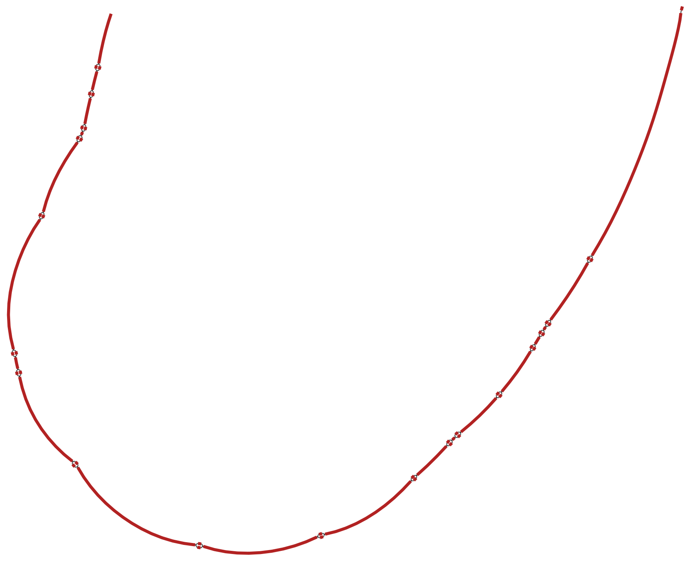
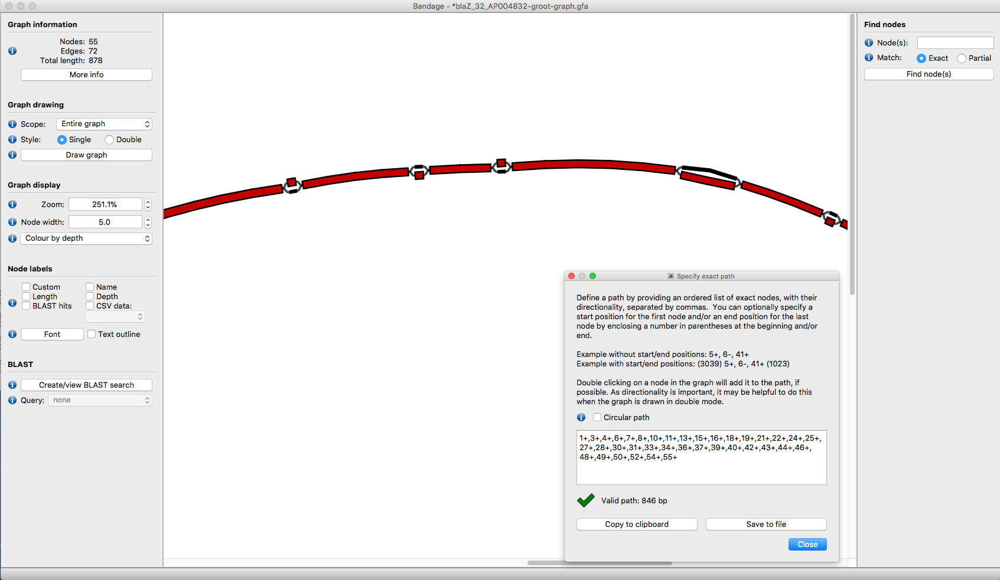

# GROOT Graphs

This is a brief overview of the graphs used by **GROOT** and what they can be used for.

***

## Overview

If you are reading this, you are probably familiar with some of the many Antibiotic Resistance Gene (**ARG**) databases that exist (e.g. ResFinder, CARD, ARG-annot). Each of these databases are basically multifasta files that contain the sequences of **ARGs** that confer resistance to antibiotics.

The **ARG** sequences in these databases can be grouped by type (based on nucleotide identity). Within each of these groups there are 1 or more **ARG** sequences which can vary from each other by 1 or more nucleotides. For example, the group of `bla-OXA` type genes contains many closely related sequences of genes encoding carbapenemases (`bla-OXA-1`, `bla-OXA-2`, `bla-OXA-3` etc.) . Traditionally, querying the **ARG** databases involves looking at each of these closely related sequences within each group in turn, even if they only vary by 1 nucleotide.

Rather than using all of the linear reference sequences in the **ARG** databases, **GROOT** collapses closely related genes into variation graphs. For example, it can take all `bla-OXA` type genes in the ResFinder database and represent these as a single variation graph. To get the groups of closely related genes within a database, the database is clustered and each cluster is stored as a [Multiple Sequence Alignment](https://en.wikipedia.org/wiki/Multiple_sequence_alignment) (**MSAs**). Please read the  [groot-databases](https://groot-documentation.readthedocs.io/en/latest/groot-databases.html) page for more information on this.

**GROOT** creates variation graphs from **MSAs** and stores them as special structures called `groot graphs`. The `groot graphs` essentially follow the format conventions of the [Graphical Fragment Assembly (GFA) format](https://github.com/GFA-spec/GFA-spec/blob/master/GFA1.md) that is used by some genome assemblers and consists of:

* `Segments`:  a continuous sequence or subsequence.

* `Links`: an overlap between two segments. Each link is from the end of one segment to the beginning of another segment. The link stores the orientation of each segment and the amount of basepairs overlapping.

* `Paths`: an ordered list of oriented segments, where each consecutive pair of oriented segments are supported by a link record.

So, a `groot graph` is:

> a series of connected nodes; each node containing a segment, the links for that segment and the paths (genes) which utilise that segment.

For example, here is a graph for a set of closely related `Bla-CTX-M` type genes:



This graph is derived from 3 genes: `(Bla)CTX-M-40`, `(Bla)CTX-M-63`, `(Bla)CTX-M-8`. Each of these genes has a path through the graph, involving different combinations of segments. **GROOT** will index each of the paths so that it can seed query reads to graph regions.


## Using the graphs

Since version 0.4, **GROOT** outputs any `groot graphs` that have had reads align to them. These graphs are in **GFA** format (`.gfa`) and can be viewed in [Bandage](https://github.com/rrwick/Bandage).

In each GFA file, **GROOT** also records the number of reads that aligned to each segment of the variation graph. This allows us to look at which variants in an ARG gene cluster are dominant in a sample. For example, let's look at a graph for `BlaZ` type genes found in a gut microbiome sample:

```
groot get -d resfinder
groot index -i resfinder.90 -o index -p 8
groot align -i index -f reads-1.fq,reads-2.fq -o groot-graphs -p 8 | groot report --lowCov

Bandage load groot-graphs/blaZ-groot-graph.gfa --draw
```

In the `Graph display` options, select `Colour by depth`. You will get something like this:


In this example, **GROOT** found two blaZ variants in a microbiome (`blaZ_35` and `blaZ_36`), but one has 50X more coverage than the other over the variant sites (the red segments).

To tell which segments come from which genes, we can overlay path information. One way to do this is to blast each reference sequence against the graph segments and then colour the segments. Another way is to specify a path:

* open the `blaZ-groot-graph.gfa` file and get the path you want to highlight

```
e.g. blaZ_35:
1+,3+,4+,6+,7+,8+,10+,11+,13+,15+,16+,18+,19+,21+,22+,24+,25+,27+,28+,30+,31+,33+,34+,36+,37+,39+,40+,42+,43+,44+,46+,48+,49+,50+,52+,54+,55+
```

* in Bandage, select `Output > Specify Exact Path For Copy` and enter the path

* Bandage will then highlight the segments in the path:



***

To finish, an important point about the RC and FC tags in the `groot-graph.gfa` files:

> RC tags record the number of reads aligned to a segment, multipled by the length of the segment. This is so that bandage displays the depth nicely. FC tags record just the raw number of reads aligned to a segment.
